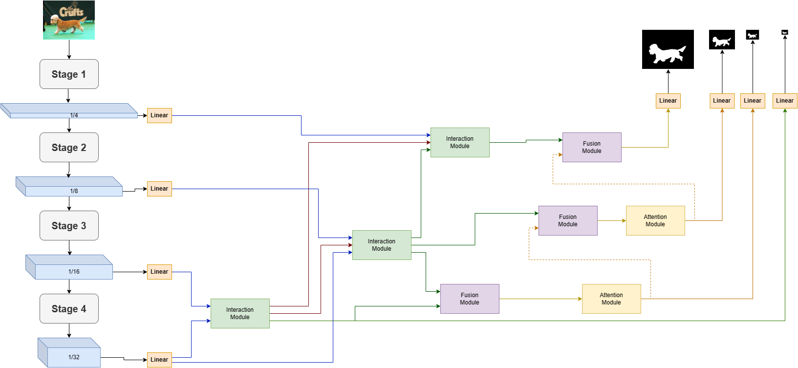

# PVST: Pyramid Vision Transformer for Saliency Detection

## 🌟 Overview

The **Pyramid Vision Transformer (PVST)** is an advanced deep learning model designed specifically for saliency detection tasks. By leveraging a hierarchical representation of images, PVST employs transformer-based architectures to efficiently process visual data and predict regions that naturally attract human attention. The model is optimized for high performance on challenging datasets and supports comprehensive evaluation metrics.



---

## ✨ Features

- **Transformer-Based Design**: Built on the Pyramid Vision Transformer (PVT) backbone, incorporating a multi-scale approach for robust feature extraction.
- **Saliency Detection Expertise**: Precisely identifies and highlights salient regions in images.
- **Hierarchical Processing**: Analyzes images at multiple levels to capture both global and local contexts.
- **Comprehensive Metrics**: Includes performance metrics such as MAE, F-measure, S-measure, E-measure, AUC, and AP.
- **GPU Acceleration**: Optimized for CUDA-enabled devices to support faster computation and training.

---

## 🚀 Installation

1. **Clone the Repository**:
   ```bash
   git clone https://github.com/DanielPamfil/PVST.git
   cd PVST
   ```

2. **Install Dependencies**:
   Ensure Python (version 3.x) and PyTorch are installed. Use the following command to install additional dependencies:
   ```bash
   pip install -r requirements.txt
   ```

3. **Dataset Preparation**:
   Organize your dataset directory structure as follows:
   ```plaintext
   Data/
   ├── DUTS/
   │   ├── DUTS-TR/
   │   │   ├── DUTS-TR-Image/
   │   │   ├── DUTS-TR-Mask/
   │   ├── DUTS-TE/
   │       ├── DUTS-TE-Image/
   │       ├── DUTS-TE-Mask/
   ├── ECSSD/
   │   ├── images/
   │   ├── GT/
   ...
   ```

4. **Pre-trained Weights**:
   Place pre-trained weights (if available) in the `pretrained_model/` directory.

---

## ⚡ Usage

### **Training**:
Train the model with the following command:
```bash
python train_test_eval.py --Training True --test_paths DUTS/DUTS-TE --pretrained_model ./pretrained_model/pvt_v2_b3.pth --save_model_dir checkpoint/pvt_v2_b3/ --arch pvt_v2_b3
```

### **Testing**:
Evaluate the model after training or with pre-trained weights:
```bash
python train_test_eval.py --Testing True --test_paths DUTS/DUTS-TE --pretrained_model ./pretrained_model/pvt_v2_b3.pth --save_model_dir checkpoint/pvt_v2_b3/
```

### **Evaluation**:
Run the evaluation script to compute metrics:
```bash
python train_test_eval.py --Evaluation True --test_paths DUTS/DUTS-TE --pretrained_model ./pretrained_model/pvt_v2_b3.pth --save_model_dir checkpoint/pvt_v2_b3/
```

### **Combined Training, Testing, and Evaluation**:
Perform all steps in a single command:
```bash
python train_test_eval.py --Training True --Testing True --Evaluation True --test_paths DUTS/DUTS-TE --pretrained_model ./pretrained_model/pvt_v2_b3.pth --save_model_dir checkpoint/pvt_v2_b3/
```

---

## 📊 Results Showcase

### Example 1 - Bike


### Example 2 - Boat


### Example 3 - Persons


